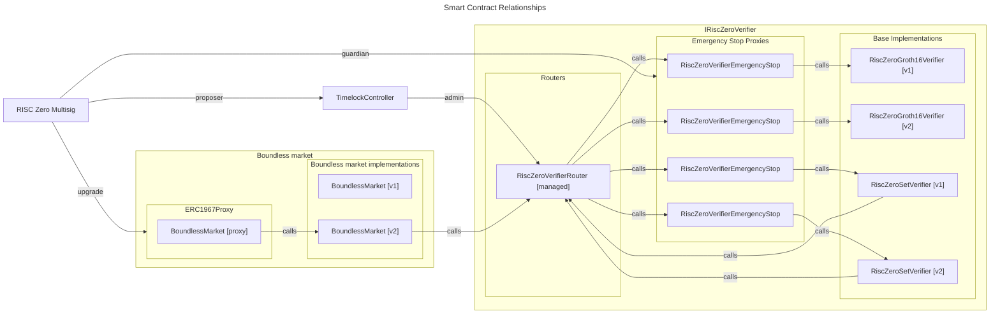

# Boundless Market Version Management

## Overview

The Boundless [BoundlessMarket](./src/BoundlessMarket.sol) contract is deployed and upgraded using an [ERC-1967][erc-1967] storage proxy and the [UUPS][uups] (Universal Upgradeable Proxy Standard) proxy pattern.
This pattern allows to upgrade the contract logic while keeping all the state, providing flexibility to improve the implementation over time without service interruptions or manual migration processes.

The Boundless market uses the RISC Zero verifier router, building upon the [verifier versioning system][verifier-versioning].

[erc-1967]: https://github.com/OpenZeppelin/openzeppelin-contracts/blob/master/contracts/proxy/ERC1967/ERC1967Proxy.sol
[uups]: https://docs.openzeppelin.com/contracts/5.x/api/proxy#UUPSUpgradeable
[verifier-versioning]: https://github.com/risc0/risc0-ethereum/blob/main/contracts/version-management-design.md
