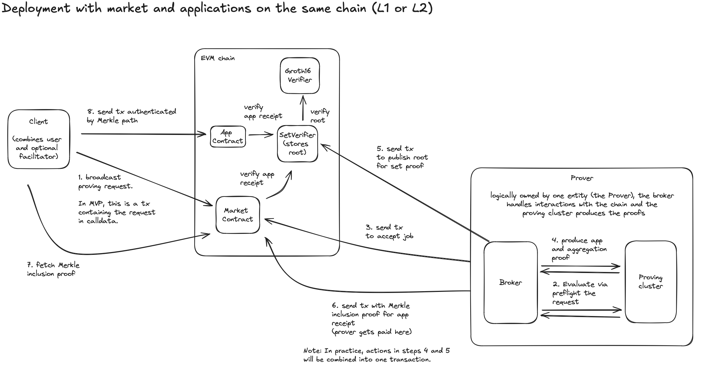
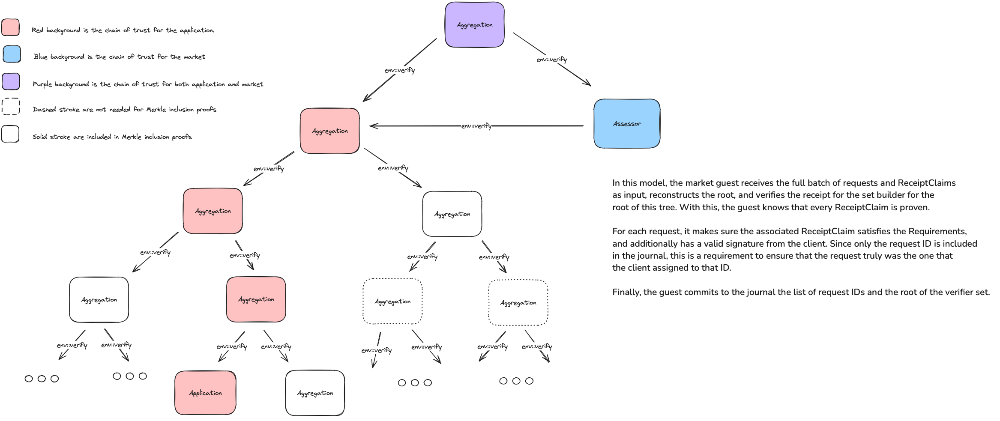

# Boundless Market v0.3 RFC

### Interaction flow

Below is a diagram of the interaction flow assuming a user with a wallet is driving it.

<figure>
  
  <cap>Boundless market diagram (<a href=https://excalidraw.com/#json=Dez07vdrpA3Hm4cX96jsF,qk9CxkIWC1AXOCN14KbQ6Q target=_blank>source</a>)</cap>
</figure>

1. [Requestor][term-requestor] broadcasts their proof request to make it available to all provers.
2. [Prover][term-prover] receives the request, attempts to fetch the [ELF binary][r0-term-elf-binary] with associated [Image ID][r0-term-image-id] and inputs, and evaluates it via preflight in the [executor][r0-term-executor]. Preflight allows the prover to know both that the request can actually be fulfilled and allows it to estimate the cost of proving. After evaluation, the prover will determine a price they would like to bid.

3. Prover sends a transaction to place their bid and lock-in the request. Upon lock-in, they have exclusive rights to be paid for the request, and must provide a requestor-specified amount of stake as collateral, burned in the event they fail to deliver a proof by the deadline.
4. Prover produces the receipt:
   1. Proves the application [guest][r0-term-guest-program] execution
   2. Optionally aggregates the request into a batch via the set builder guest.
   3. Proves the request conditions are met via the Assessor guest.
   4. Adds the Assessor receipt to the batch via the set builder guest.
   5. Compresses the batch receipt via Groth16
5. Prover sends a transaction to post the set commitment (i.e. Merkle root) to the set verifier contract.
6. Prover sends a transaction to the market contract to post the Merkle inclusion proof for the application and Assessor receipts in the batch, and to fulfill the request. At this point, the prover has delivered the requested proof and is paid for their work.
7. Requestor fetches the Merkle inclusion path, which acts as their receipt seal from the EVM calldata or event logs.
8. Requestor sends a transaction to complete their application flow, with authentication provided by the receipt.

### Market contract and guest

Market operations such as the auction and settlement are implemented in a smart contract.

#### Order placement

**Order broadcast:** Requestors will initiate an order by broadcasting a `ProvingRequest` to the provers. Requestors have a choice of two broadcast channels depending on their needs:

- Broadcast via EVM calldata. This has the highest possible assurance for data availability and censorship resistance.
- Broadcast via an off-chain broadcast channel. This has the lowest cost and latency.

  Off-chain broadcast channel is not a requirement for the initial MVP deployment. It is however important to keep it in mind. Submitting an order cannot alter EVM state.

**Authentication**: Requests are signed by the requestor EOA with an [EIP-712](https://github.com/ethereum/EIPs/blob/master/EIPS/eip-712.md) signature.

**Request structure:**

```solidity
struct ProvingRequest {
    /// Unique ID for this request, constructed from the client address and a 32-bit counter.
    /// Constructed as (address(client) << 32) | id
    uint192 id;
    /// Requirements of the delivered proof. Specifies the program that must be run, and constrains
    /// value of the journal, specifying the statement that is requesting to be proven.
    Requirements requirements;
    /// A public URI where the program (i.e. image) can be downloaded. This URI will be accessed by
    /// provers that are evaluating whether to bid on the request.
    string imageUrl;
    /// Input to be provided to the zkVM guest execution.
    Input input;
    /// Offer specifying how much the client is willing to pay to have this request fulfilled.
    Offer offer;
}

struct Requirements {
    bytes32 imageId;
    Predicate predicate;
}

struct Predicate {
    PredicateType predicateType;
    bytes data;
}

enum PredicateType {
    DigestMatch,
    PrefixMatch
}

struct Input {
    InputType inputType;
    bytes data;
}

enum InputType {
    Inline,
    Url
}

struct Offer {
    // Price at the start of the bidding period, it is minimum price a prover will receive for job.
    uint96 minPrice;
    // Price at the end of the bidding period, this is the maximum price the client will pay.
    uint96 maxPrice;
    // Block number at which bidding starts.
    uint64 biddingStart;
    // Length of the "ramp-up period," measured in blocks.
    // Once bidding starts, the price begins to "ramp-up." During this time,
    // the prise rises each block until it reaches maxPrice.
    uint32 rampUpPeriod;
    // Timeout for delivering the proof, expressed as a number of blocks from bidding start.
    // Once locked-in, if a valid proof is not submitted before this deadline,
    // the prover can be "slashed," which refunds the price to the requester.
    uint32 timeout;
    // Bidders must stake this amount as part of their bid.
    uint96 lockinStake;
}
```

#### Order matching

> For details, see the [Market Matching Design][page-market-design] document.

**Auction:** Provers bid on requests in a reverse Dutch auction, where the price the requestor is offering starts at some low initial amount, and is raised over the period of time that the auction is open until some max price is reached. If at any point in the auction a prover submits a bid, the current price is used as the final price and the auction is closed. In this way, only a single bid is ever sent to the blockchain. This occurs in the form of a lock-in request that also grants the prover exclusive rights to be paid for the request.

**Exclusivity**: A prover may submit a transaction to lock-in a request. In order to do so, they must supply an amount of stake (i.e. collateral) specified by the requestor. If the prover does not deliver a proof by the deadline specified in the request, the prover's stake is burned. In this way, provers can be assured they will be paid for their proving work, as opposed to having to race others, while ensuring provers are incentivized only to take work they can actually complete.

**Escrow**: As part of the lock-in, funds are deducted from both the requestor and prover accounts. Funds are deducted from the requestor account and held in escrow on the market to ensure the prover will be paid upon delivering the proofs. Funds are deducted from the prover account to cover any lock-in stake specified by the requestor. These funds are sent to the prover upon fulfillment of the order. If the deadline passes, the price of the proof can be returned to the requestor, and the prover stake is burned.

#### Order fulfillment

**Requirements checking**: Once the prover has a proof that satisfies the requirements they will run the [Assessor](#assessor), which is a guest program that will verify the application receipt through composition and check that it satisfies the given requirements. Using this method, the full request does not need to be provided as part of fulfillment, only the associated identifier.

**Guaranteed delivery**: In order to settle the order and receive payment, the prover must submit a receipt that meets the requirements of the request. This receipt is posted to the chain in calldata as part of the settlement transaction as a form of "guaranteed delivery". In this way, the receipt is now public such that the requestor can query the blockchain to receive it. In general, any data availability solution would also work here.

**Aggregation and verification caching:** One of the most expensive parts of using a SNARK in a smart contract application is the verification cost. This cost is amortized across a batch of requests by recursively verifying a set of receipts, and constructing a Merkle tree over the claims for efficient inclusion proofs. Additionally, it is assumed that the requestor will use the receipt they receive to drive on-chain functionality which will require them to verify the receipt as part of that application flow. In order to guarantee this is efficient, the market uses a set verifier that caches the root of the receipt claim Merkle tree, and the receipt used by the application is a Merkle inclusion path against that root.

**Fulfillment structure:**

```solidity
// Info posted by the prover to fulfill a request, and get paid.
struct Fulfillment {
    uint192 id;
    bytes32 imageId;
    bytes journal;
    bytes seal;
}

// Structured journal of the Assessor guest which verifies the signature(s)
// from client(s) and that the requirements are met by claim digest(s) in the
// Merkle tree committed to by the given root. Assessor can verify a batch of
// requests, including batches of size one.
struct AssessorJournal {
    uint192[] requestIds;
    // Root of the Merkle tree committing to the set of proven claims.
    // In the case of a batch of size one, this may simply be a claim digest.
    bytes32 root;
    // EIP712 domain separator.
    bytes32 eip712DomainSeparator;
    // The address of the prover that produced the assessor receipt.
    address prover;
}
```

#### Market Contract Interface

> See `contracts/src/IProofMarket.sol` for the present implementation.

```solidity
interface IProofMarket {
    /// Event logged when a new proving request is submitted by a client.
    event RequestSubmitted(ProvingRequest request, bytes clientSignature);
    /// Event logged when a request is locked in by the given prover.
    event RequestLockedin(uint192 indexed requestId, address prover);
    /// Event logged when a request is fulfilled.
    event RequestFulfilled(uint192 indexed requestId);
    /// @notice Event logged when a proof is delivered that satisfies the requests requirements.
    /// @dev It is possible for this event to be logged multiple times for a single request. This
    /// is usually logged as part of order fulfillment, however it can also be logged by a prover
    /// sending the proof without payment.
    event ProofDelivered(uint192 indexed requestId, bytes journal, bytes seal);
    /// Event when prover stake is burned for failing to fulfill a request by the deadline.
    event LockinStakeBurned(uint192 indexed requestId, uint96 stake);
    /// Event when a deposit is made to the proof market.
    event Deposit(address indexed account, uint256 value);
    /// Event when a withdrawal is made from the proof market.
    event Withdrawal(address indexed account, uint256 value);

    /// Request is locked when it was not expected to be.
    error RequestIsLocked(uint192 requestId);
    /// Request is not locked when it was expected to be.
    error RequestIsNotLocked(uint192 requestId);
    /// Request is fulfilled when it was not expected to be.
    error RequestIsFulfilled(uint192 requestId);
    /// Request is no longer valid, as the deadline has passed.
    error RequestIsExpired(uint192 requestId, uint64 deadline);
    /// Request is still valid, as the deadline has yet to pass.
    error RequestIsNotExpired(uint192 requestId, uint64 deadline);
    /// Unable to complete request because of insufficient balance.
    error InsufficientBalance(address account);
    /// Request has been slashed already.
    error RequestAlreadySlashed(uint192 requestId);

    /// @notice Check if the given request has been locked (i.e. accepted) by a prover.
    /// @dev When a request is locked, only the prover it is locked to can be paid to fulfill the job.
    function requestIsLocked(uint192 requestId) external view returns (bool);
    /// @notice Check if the given request has been fulfilled (i.e. a proof was delivered).
    function requestIsFulfilled(uint192 requestId) external view returns (bool);
    /// @notice Return when the given request expires.
    function requestDeadline(uint192 requestId) external view returns (uint64);

    /// @notice Deposit Ether into the proof market to pay for proof and/or lockin stake.
    /// @dev Value deposited is msg.value and it is credited to the account of msg.sender.
    function deposit() external payable;
    /// @notice Withdraw Ether from the proof market.
    /// @dev Value is debited from msg.sender.
    function withdraw(uint256 value) external;
    /// @notice Check the deposited balance, in Ether, of the given account.
    function balanceOf(address addr) external view returns (uint256);

    /// @notice Submit a request such that it is publicly available for provers to evaluate and bid on.
    ///         Any `msg.value` sent with the call will be added to the balance of `msg.sender`.
    /// @dev Submitting the transaction only broadcasting it, and is not a required step.
    function submitRequest(ProvingRequest calldata request, bytes calldata clientSignature) external payable;

    /// @notice Lock the proving request to the prover, giving them exclusive rights to be paid to
    /// fulfill this request, and also making them subject to slashing penalties if they fail to
    /// deliver. At this point, the price for fulfillment is also set, based on the reverse Dutch
    /// auction parameters and the block at which this transaction is processed.
    /// @dev This method should be called from the address of the prover.
    function lockin(ProvingRequest calldata request, bytes calldata clientSignature) external;

    /// @notice Lock the proving request to the prover, giving them exclusive rights to be paid to
    /// fulfill this request, and also making them subject to slashing penalties if they fail to
    /// deliver. At this point, the price for fulfillment is also set, based on the reverse Dutch
    /// auction parameters and the block at which this transaction is processed.
    /// @dev This method uses the provided signature to authenticate the prover.
    function lockinWithSig(
        ProvingRequest calldata request,
        bytes calldata clientSignature,
        bytes calldata proverSignature
    ) external;

    /// @notice Fulfill a locked request by delivering the proof for the application.
    /// Upon proof verification, the prover that locked the request will be paid.
    /// @param fill The fulfillment information, including the journal and seal.
    /// @param assessorSeal The seal from the Assessor guest, which is verified to confirm the
    /// request's requirements are met.
    /// @param prover The address of the prover that produced the fulfillment.
    /// Note that this can differ from the address of the prover that locked the
    /// request. When they differ, the locked-in prover is the one that received payment.
    function fulfill(Fulfillment calldata fill, bytes calldata assessorSeal, address prover) external;
    /// @notice Fulfills a batch of locked requests. See IProofMarket.fulfill for more information.
    function fulfillBatch(Fulfillment[] calldata fills, bytes calldata assessorSeal, address prover) external;

    /// @notice Delivers a proof satisfying a referenced request, without modifying contract state.
    /// In particular, calling this method will not result in payment being sent to the prover, or
    /// marking the request as fulfilled.
    /// @dev This method is useful for when an interested third party wants to delivery a proof for
    /// a request even if they will not be paid for doing so.
    /// @param fill The fulfillment information, including the journal and seal.
    /// @param assessorSeal The seal from the Assessor guest, which is verified to confirm the
    /// request's requirements are met.
    /// @param prover The address of the prover that produced the fulfillment.
    /// Note that this can differ from the address of the prover that locked the
    /// request.
    function deliver(Fulfillment calldata fill, bytes calldata assessorSeal, address prover) external;
    /// @notice Delivers a batch of proofs. See IProofMarket.deliver for more information.
    function deliverBatch(Fulfillment[] calldata fills, bytes calldata assessorSeal, address prover) external;

    /// @notice Checks the validity of the request and then writes the current auction price to
    /// transient storage.
    /// @dev When called within the same transaction, this method can be used to fulfill a request
    /// that is not locked. This is useful when the prover wishes to fulfill a request, but does
    /// not want to issue a lock transaction e.g. because the stake is to high or to save money by
    /// avoiding the gas costs of the lock transaction.
    function priceRequest(ProvingRequest calldata request, bytes calldata clientSignature) external;

    /// @notice A combined call to `IProofMarket.priceRequest` and `IProofMarket.fulfillBatch`.
    /// The caller should provide the signed request and signature for each unlocked request they
    /// want to fulfill. Payment for unlocked requests will go to the provided `prover` address.
    function priceAndFulfillBatch(
        ProvingRequest[] calldata requests,
        bytes[] calldata clientSignatures,
        Fulfillment[] calldata fills,
        bytes calldata assessorSeal,
        address prover
    ) external;

    /// @notice Combined function to submit a new merkle root to the set-verifier and call fulfillBatch.
    /// @dev Useful to reduce the transaction count for fulfillments
    function submitRootAndFulfillBatch(
        bytes32 root,
        bytes calldata seal,
        Fulfillment[] calldata fills,
        bytes calldata assessorSeal,
        address prover
    ) external;

    /// When a prover fails to fulfill a request by the deadline, this method can be used to burn
    /// the associated prover stake.
    function slash(uint192 requestId) external;

    /// EIP 712 domain separator getter
    function eip712DomainSeparator() external view returns (bytes32);

    /// Returns the assessor imageId and its url.
    function imageInfo() external view returns (bytes32, string memory);
}
```

### Proof Aggregation

Verification of SNARKs in the EVM is expensive. In the case of our Groth16 receipts, it costs around 250k gas, which makes it the largest single cost for more applications.

In order to amortize this on-chain verification cost, we use recursive verification to verify a set of receipts such that a single receipt attests to every claim in the set. In order to make inclusion proofs efficient, this process builds a binary Merkle tree of the receipt claims.

#### Set Verifier Contract

In the EVM, the Groth16 receipt of set builder execution for the root of the Merkle tree is verified, and the verified root is written to EVM storage. Once this root is recorded, a Merkle inclusion path can act as a proof for the individual claims in the set. In this way, the set verifier implements the `IRiscZeroVerifier` interface, accepting this Merkle inclusion path as the seal in the `verify` call.

```solidity
interface IRiscZeroSetVerifier is IRiscZeroVerifier {
    error VerificationFailed();

    /// A new root has been added to the set.
    event VerifiedRoot(bytes32 root);

    /// Publishes a new root of a proof aggregation.
    function submitMerkleRoot(bytes32 root, bytes calldata seal) external;

    /// Returns whether `root` has been submitted.
    function containsRoot(bytes32 root) external view returns (bool);

    /// Returns the set builder imageId and its url.
    function imageInfo() external view returns (bytes32, string memory);
}
```

### Assessor

In order to fulfill a request, the prover must show that they have a signed request, and a receipt that meets the requirements of that request. This could be accomplished by having the prover post the signed request, including offer and requirements, in the fulfillment transaction and verify this invariant on-chain. However, this is expensive and results in data posted that is not strictly needed to transition the state of the contract (i.e. to pay the prover and mark the request as fulfilled).

In order to make this more efficient, we introduce the Assessor, which is a [guest program][r0-term-guest-program] that enforces these checks.

As input, the Assessor accepts:

- A list of requests, including offer and requirements, that the prover has completed.
- A list of image IDs and journals which the prover has assembled into a Merkle tree using the Aggregator.
- The smart contract address for the market that will be posted to. This smart contract address is used solely to construct the EIP-712 Domain and complete signature checks on the requests.

As a special case, the Assessor will accept a single request and receipt claim as a list of one.

During execution, the Assessor checks:

1. Each request is signed by the requestor address embedded in the request ID.
2. The journal and image ID provided to fulfill the request meet the requirements (i.e. that the image ID matches, and the journal satisfies the provided predicate).
3. The root of the Merkle tree constructed from the list of receipt claims, is verified by a receipt from the set builder guest. This step is checked by composition using the `env::verify` API.

The Assessor commits to the journal an EVM ABI encoded structure that includes the request IDs of the requests it checked, as well as the root for the Merkle tree formed by the receipt claims.

```solidity
// Structured journal of the Assessor guest which verifies the signature(s)
// from client(s) and that the requirements are met by claim digest(s) in the
// Merkle tree committed to by the given root. Assessor can verify a batch of
// requests, including batches of size one.
struct AssessorJournal {
    uint192[] requestIds;
    // Root of the Merkle tree committing to the set of proven claims.
    // In the case of a batch of size one, this may simply be a claim digest.
    bytes32 root;
    // EIP712 domain separator
    bytes32 eip712DomainSeparator;
}
```

After the Assessor is executed and proven, it is added to a running batch for efficient on-chain verification. A diagram showing the Merkle tree constructed by the set builder for aggregate verification.

<figure>
  
  <cap>Assessor diagram (<a href=https://excalidraw.com/#json=7Zh4h6tXCY2mR2NLW8DvF,ixQZR3mEgm4Z5w6vtT86Xg target=_blank>source</a>)</cap>
</figure>

[term-requestor]: ../glossary.md#requestor
[term-prover]: ../glossary.md#prover
[page-market-design]: ./matching.md
[r0-term-executor]: https://dev.risczero.com/terminology#executor
[r0-term-image-id]: https://dev.risczero.com/terminology#image-id
[r0-term-guest-program]: https://dev.risczero.com/terminology#guest-program
[r0-term-elf-binary]: https://dev.risczero.com/terminology#elf-binary
