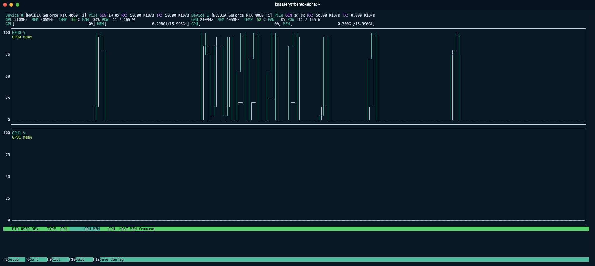

# Bento Performance Tuning

This guide offers practical techniques for optimizing your initial Bento deployment.

<div class="warning">

Bento performance is tightly couples to the specific environment, equipment, and provider's requirements. Recommendations in this guide should be used as reference rather than a concrete recommendation on configuration.

</div>

## Recommended tools

Prior to starting we recommend the following tools monitor performance and resource use:

- [nvtop](https://github.com/Syllo/nvtop) - A tool to monitor GPU utilization.
- [htop](https://htop.dev/) - A tool to monitor CPU utilization, system memory, and process status.

Both of these tools warrant a decent size terminal window on your desktop to monitor the performance during experiments.

## Isolating tests

Operating competing workloads on the same system as your Bento deployment can lead to unpredictable results. We recommend isolating your test system from other workloads to ensure that the performance tuning results are consistent and reliable. This includes stopping configured [Broker][page-broker] services:

```bash
docker ps
docker stop <BROKER_CONTAINER_ID>
```

Alternatively you can modify your `scripts/boundless_service.sh` to remove `--profile broker`.

## Defining a test harness

It is preferable to benchmark using an example of your actual workload. Using a representative workload will provide more accurate turn around times, and validate your ELF and inputs file for the proofs you plan to generate. To try a realistic example:

```bash
RUST_LOG=info cargo run --bin bento_cli -- -f /path/to/elf -i /path/to/input`
```

If you intend to operate across a variety of different workloads (such as those that may be fed by [Broker][page-broker]) you can also use the following command to generate a synthetic workload:

```bash
RUST_LOG=info cargo run --bin bento_cli -- -c <ITERATION_COUNT>
```

Where iteration count is the number of times the synthetic guest is executed. A value of 4096 is a good starting point, however on smaller or less performant you may want to reduce this to 2048 or 1024 while performing some of your experiments. For functional testing, 32 is sufficient.

The typical test process will be:

1. start `nvtop` and `htop`
1. execute the test harness above and copy the job id
1. upon completion of the job use [the `script/job_status.sh`](https://github.com/boundless-xyz/boundless/blob/main/scripts/job_status.sh) to view the results

Example test run of 1024 iterations:

```bash
RUST_LOG=info cargo run --bin bento_cli -- -c 1024
```

```txt
2024-10-17T15:27:34.469227Z  INFO bento_cli: image_id: a0dfc25e54ebde808e4fd8c34b6549bbb91b4928edeea90ceb7d1d8e7e9096c7 | input_id: 3740ebbd-3bef-475f-b23d-6c2bf96c6551
2024-10-17T15:27:34.479904Z  INFO bento_cli: STARK job_id: 895a996b-b0fa-4fc8-ae7a-ba92eeb6b0b1
2024-10-17T15:27:34.480919Z  INFO bento_cli: STARK Job running....
...
2024-10-17T15:27:56.509275Z  INFO bento_cli: STARK Job running....
2024-10-17T15:27:58.513718Z  INFO bento_cli: Job done!
```

```bash
echo 895a996b-b0fa-4fc8-ae7a-ba92eeb6b0b1 | bash scripts/job_status.sh
```

```txt
 jobs_count 
------------
         19
(1 row)

 remaining_jobs 
----------------
              0
(1 row)

task times:
 task_id | task_type | state | wall_time |         started_at         
---------+-----------+-------+-----------+----------------------------
 init    | Executor  | done  |  0.530216 | 2024-10-17 15:27:35.00974
 0       | Prove     | done  |  3.299771 | 2024-10-17 15:27:35.661319
 1       | Prove     | done  |  3.129968 | 2024-10-17 15:27:35.818467
 3       | Prove     | done  |  2.998964 | 2024-10-17 15:27:38.963914
 2       | Join      | done  |  1.123467 | 2024-10-17 15:27:38.9684
 4       | Prove     | done  |  2.901972 | 2024-10-17 15:27:40.105599
 7       | Prove     | done  |  3.001664 | 2024-10-17 15:27:41.977001
 5       | Join      | done  |  1.237363 | 2024-10-17 15:27:43.022033
 6       | Join      | done  |  1.154148 | 2024-10-17 15:27:44.273276
 8       | Prove     | done  |  3.096732 | 2024-10-17 15:27:44.992537
(10 rows)

Effective Hz:
         hz          | total_cycles | elapsed_sec 
---------------------+--------------+-------------
 399385.599822715909 | 8650752      |   21.660150
(1 row)
```

<div class="warning">

Note that in the `job_status.sh` output above, the Hz is only accurate if the job has completed with no error conditions. Failed and in-progress jobs will have an inflated Hz value.

</div>

In the final table, the effective Hz is the primary metric for consideration. This represents the (number of cycles) / (elapsed wallclock time). In the example above, the effective Hz is roughly 400kHz.

## Finding a maximum `SEGMENT_SIZE` for GPU VRAM

In most scenarios it makes sense to start by optimizing our GPU workers. This is because the bulk of the RISC Zero workload is executed by the `gpu-agent` and GPU resources a most often the performance bottleneck.

A critical concept to understand as we begin this testing is related to [RISC Zero's continuations][r0-term-continuations]. [Continuations](https://dev.risczero.com/api/recursion) are the key mechanism that allow RISC Zero to scale to effectively handle arbitrarily large proofs.

The CPU first runs the workload in a pre-flight stage where it doesn't engage in proving, while doing so it divides the program trace into a series of [segments][r0-term-segment]. In Bento these segments are then dispatched to various workers for proving, and are combined back together in the final stage to produce the proof.

The key tuning parameter of continuations is `SEGMENT_SIZE` in the `.env-compose` file. A proof is divided into `(2^SEGMENT_SIZE)` sized segments. The default value is 20, which means that a proof is composed of the number of required segments of approximately 1M cycles `(2^20 = 1048576)`.

`SEGMENT_SIZE has` some practical implications, related to GPU VRAM capacity. Below is a set of guidelines for setting `SEGMENT_SIZE` maximums:

| VRAM | `SEGMENT_SIZE` Max |
| ---- | ------------------ |
| 8GB  | 19                 |
| 16GB | 20                 |
| 20GB | 21                 |

Once you have selected a `MAXIMUM` segment size you should verify that the GPU does in fact have enough memory to complete.

In the following test, an RTX 4060 with 16GB VRAM attempts to run with a `SEGMENT_SIZE` of 21, which is too large for the GPU to handle. In this test, it is necessary to monitor the `gpu-agent` docker logs to determine the cause of the failure (note boundless should be restarted upon changing the `SEGMENT_SIZE` value, and verify that [Broker][page-broker] is not running):

```bash
RUST_LOG=info cargo run --bin bento_cli -- -c 4096
```

```txt
2024-10-17T15:58:15.205138Z  INFO bento_cli: image_id: a0dfc25e54ebde808e4fd8c34b6549bbb91b4928edeea90ceb7d1d8e7e9096c7 | input_id: fe7f4251-25f4-436f-b782-f134d4c80538
2024-10-17T15:58:15.210646Z  INFO bento_cli: STARK job_id: bbf442eb-40db-44fb-8df4-f13a8ce10bf2
2024-10-17T15:58:15.211686Z  INFO bento_cli: STARK Job running....
....
```

We then examine the `gpu-agent` logs and see a series of out of memory errors:
`docker logs bento-gpu_agent0`

```
2024-10-17T15:57:43.667484Z  INFO workflow::tasks::prove: Starting proof of idx: 6f95e238-d0be-4e94-9e81-fefdc0b7d8c4 - 1
thread 'main' panicked at /usr/local/cargo/registry/src/index.crates.io-6f17d22bba15001f/risc0-zkp-1.1.1/src/hal/cuda.rs:206:61:
called `Result::unwrap()` on an `Err` value: OutOfMemory
stack backtrace:
   0: rust_begin_unwind
             at ./rustc/129f3b9964af4d4a709d1383930ade12dfe7c081/library/std/src/panicking.rs:652:5
   1: core::panicking::panic_fmt
             at ./rustc/129f3b9964af4d4a709d1383930ade12dfe7c081/library/core/src/panicking.rs:72:14
   2: core::result::unwrap_failed
             at ./rustc/129f3b9964af4d4a709d1383930ade12dfe7c081/library/core/src/result.rs:1654:5
```

Indicating that the GPU is out of memory. In this case, the `SEGMENT_SIZE` should be reduced.

Note that if you have a multi-GPU system, your `SEGMENT_SIZE` should be set to the lowest common denominator of the GPUs in the system, so benchmarking should be performed on that card by tuning device-id in `compose.yml`.

*** NOTE: ***: If a job fails to complete due to OOM, it may be resumed after Bento has been restarted. It's important to ensure that resumed jobs are not in progress during the test harness execution.

## Benchmark single GPU's `SEGMENT_SIZE`

Configure a single GPU instance:

_**compose.yml**_:

```
gpu_agent0: &gpu
    image: agent
    runtime: nvidia
    pull_policy: never
    restart: always
    depends_on:
      - postgres
      - redis
      - minio

    mem_limit: 4G
    cpu_count: 4
```

Verify that no other GPU definitions are present in the compose file.

Confirm the `SEGMENT_SIZE` is set to the maximum as determined above in the `.env-compose` file.

Execute the test harness:

```
RUST_LOG=info cargo run --bin bento_cli -- -c 4096
```

Confirm single GPU utilization using `nvtop`:

<figure>
  
  <cap>Monitoring Bento with <a target="_blank" href="https://github.com/Syllo/nvtop">nvtop</a> </cap>
</figure>

Review the effective Hz:

```
echo <JOB_ID> | bash scripts/job_status.sh
```

Example results:

```
...

Effective Hz:
         hz          | total_cycles | elapsed_sec 
---------------------+--------------+-------------
 264892.074666431500 | 34603008     |  130.630590
(1 row)
```

Here we see that our single `gpu-agent` at max `SEGMENT_SIZE` is able to achieve an effective 264kHz.

## Multiple agents and GPUs

We can incorporate multiple GPUs into a configuration. In this example, we have two 16GB GPU as that proved to be optimal above:

`compose.yml`

```yml
...
  gpu_agent0: &gpu
    image: agent
    runtime: nvidia
    pull_policy: never
    restart: always
    depends_on:
      - postgres
      - redis
      - minio
...
  gpu_agent1:
     <<: *gpu

     deploy:
       resources:
         reservations:
           devices:
             - driver: nvidia
               device_ids: ['0']
               capabilities: [gpu]

  gpu_agent2:
     <<: *gpu

     deploy:
       resources:
         reservations:
           devices:
             - driver: nvidia
               device_ids: ['1']
               capabilities: [gpu]

  gpu_agent3:
     <<: *gpu

     deploy:
       resources:
         reservations:
           devices:
             - driver: nvidia
               device_ids: ['1']
               capabilities: [gpu]
...
```

Here are the effective results on our example system:

```txt
431375.207834042771 | 35127296     |   81.430957
```

In this case, we see that the effective Hz has increased to 431kHz, which is a significant improvement over the single GPU configuration; however we anticipated if the system was GPU limited we could expect 264Hz * 2 = 528Hz.

This means that our example system is bound by some other factor such as bus bandwidth, memory, etc.

In this case we suggest:

- Reconfigure the system back to higher PO2 with single agent per GPU and establish a new baseline performance level to compare against.
- In lower `SEGMENT_SIZE` configurations experiment with `cpu_count` and `mem_limit` (removing, increasing, or decreasing) to see if the performance can be improved. In cases where bus contention is the limiting factor, running fewer agents at higher maximum `SEGMENT_SIZE` may be optimal. Systems in this configuration should avoid GPU expansion, and instead opt to expand into remote workers.

[r0-term-continuations]: https://dev.risczero.com/terminology#continuations
[r0-term-segment]: https://dev.risczero.com/terminology#segment
[page-broker]: ../broker/README.md
